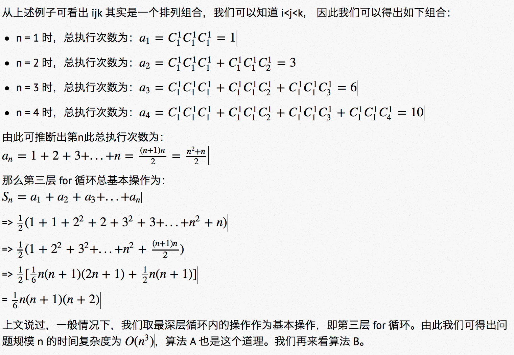

# 01-哥德巴赫猜想(Goldbach's Conjecture)--(C语言)


## 前言

哥德巴赫猜想是([Goldbach's Conjecture](https://zh.wikipedia.org/zh-cn/哥德巴赫猜想))是数论中存在最久的未解问题之一，是一个伟大的世界性的数学猜想，其基本思想可以陈述为：

> 任何一个大于2的偶数，都能表示成两个素数之和。

如：
4 = 2 + 2
6 = 3 + 3
96= 23 + 73

本文将采用两种不同的算法来求出给定范围 n 内的哥德巴赫数字，并对比其时间复杂度，得出更优算法。

## 分析

根据哥德巴赫猜想，我们可以得出如下信息：

1. 哥德巴赫数字是一个大于2的偶数。
2. 哥德巴赫数字等于两个素数相加。

### 思路A

思路A与之前见过的很多想法一样，简单粗暴，采用嵌套 for 循环。思路如下：

1. for 循环依次遍历 [4, n] 范围内的**偶数**。
2. 然后，针对每个数字（c）再次进行 for 循环找出两个数字（a,b）之和等于该数字的数字。（即 c = a + b）
3. 判断 a,b 是否都为素数。
4. 输出结果。

Show the (**garbage**) code!

### 实现A

我们把思路A实现的程序分成两个功能模块：

1. 判断是否为素数模块 int isPrime(int i)，返回 1 即为素数。

    ```
    
    int isPrime(int i) {
        int j;
        if (i <= 1) return 0;
        if (i == 2) return 1;
        for (j = 2; j < i; j ++) {
            number ++;
            if (i % j == 0) {
            return 0;
            }else if(i != j + 1) {
                continue;
            }else {
                return 1;
            }
        }
    }
    
    ```
    
    
2. 主程序模块：针对 [4, n] 之间的正偶数进行数值拆分，然后再用isPrime函数进行筛选，如果k，j都为素数，即满足哥德巴赫猜想，输出该数字。
    
    ```
    do {
        printf("please enter a number:");
        int number = 0;
        scanf("%d", &number);
        int i, j, k;
        for (int i = 4; i <= number; i += 2) {
            for (k = 2; k<= i/2; k ++) {
                j = i - k;
                if (isPrime(k)) {
                    if (isPrime(j)) {
                        printf("%d=%d+%d\n",i, k, j);
                    }
                }
            }
        }
    }while (1);
    
    ```

### 思路B

递归算法，也是我业余时间自己写的一个，递归路径类似鱼骨头，基本思路如下：

1. 针对输入的 n 进行拆分（c = a + b 的形式）并递归。
2. 如果拆分的数字 a,b 为偶数，则可能为符合哥德巴赫猜想，回到1。
3. 如果 c 为偶数，且 a,b 为素数，即满足哥德巴赫猜想，输出该数字。

这里笔者画了一张抽象的鱼骨头图，帮助读者理解：


### 实现B

思路B实现的程序主要分成三个功能模块，为了区分思路A，判断素数的模块也采用递归的形式：

1. 判断是否为素数 int isPrime(int i)，返回 1 即为素数。
    
    ```
    
    // 判断偶数
    int isEven(int original) {
        return (original % 2 == 0);
    }
    
    int isPrimeInner(int original, int current) {
        if (current<=0 || original<=0 || original == 1) return 0;
        if (original % 2 == 0) {
            if (original == 2) return 1;
            return 0;
        }
        if (current > (original / 2) + 1) return 1;
        if (original % current == 0 && current != 1) return 0;
        return isPrimeInner(original, current + 2);
    }
    
    // 判断是否为偶数
    int isPrime(int original) {
        return isPrimeInner(original, 1);
    }
    
    ```
    
2. 递归模块

    参数 `current`: 代表分裂初始值，参数 `flag`: 代表是否深入遍历，此处用于控制重复遍历的情况，如：original=10 时，second=8 时，两次会都会重复遍历 6/4/2，因此加入flag进行限制，只进行一次深入遍历！！
    
    ```
    
    void splitSumInner(int c, int current, int flag) {
        // 哥德巴赫为大于2的偶数
        if (c <= 2) return;
        // 如果 current 大于 c 的一半，即代表遍历完毕
        if (current >= (c / 2) + 1) return;
    
        // 第一次分裂 c 数值
        int a = current;
        int b = c - current;

        // 递归遍历并分裂 c 数值
        splitSumInner(c, ++ current, flag);
    
        // 判断能否深入遍历
        if (flag && a > 2 && isEven(a)) {
            // 深入遍历 分裂第一个子偶数
            splitSum(a, 0);
        }
    
        if (flag && b > 2 && isEven(b)) {
            // 深入遍历 分裂第二个子偶数
            splitSum(b, 0);
        }
        
        // 如果 c 为偶数，且 a,b 为素数，即满足哥德巴赫猜想，输出该数字。
        if (isEven(c) && isPrime(a) && isPrime(b)) {
            printf("\n%d=%d+%d\n",c, a, b);
        }
    }
    
    // original: 待分裂的原始数值（ps：会自动分裂 小于 original 下的所有数值）
    // flag: 1 代表分裂小于 original 下的所有数值；0 代表分裂当前 original 数值
    void splitSum(int original, int flag) {
        splitSumInner(original, 1, flag);
    }
    
    ```
3. 主程序模块

    ```
    
    void goldbachConjecture(int n) {
        splitSum(n, 1);
    }

    int main() {
        do {
            printf("please enter a number:");
            int number = 0;
            scanf("%d", &number);
            goldbachConjecture(number);
        } while (1);
        return 0;
    }
    
    ```

### 时间复杂度对比

时间复杂度说白了就是算法中基本操作的执行次数，更通俗的说法，就是最深层循环内的语句。基本操作的重复执行次数是和算法的执行时间成正比的。下面我们来粗略计算一下上述算法的时间复杂度。

#### A 算法分析

在程序 A 中，与下面的代码相同，采用嵌套三层 for 循环的方式进行遍历：

    ```
    
    for (int i = 1; i <= n; i ++) { // 第一层循环
            for (int j = 1; j <= i; j ++) { // 第二层循环
                for (int k = 1; k <= j; k ++) { // 第三层循环
                    count ++;
                    printf("%d*%d*%d\n", i, j, k);
                }
            }
        }
    
    ```
    
下面我们来剖析一下基本操作：

1. 第一层 for 循环执行 n 次。
2. 第二层 for 循环以 i 为规模分别执行 1,2,3,4......n-1,n 次，集一个公差为 1 的等差数列，总次数为 (n+1)*n/2。
3. 第三层 for 循环采用排列组合来计算，举个例子，当 n = 3 时，有 10 次基本操作，我们把执行路径格式定义成 ijk，如下:

    ```
    
    111
    211  221  222
    311  321  322  331  332  333
    
    ```



#### B 算法分析


#### 结论

以上时间复杂度只是笔者通过简单粗略的分析得出，仅供参考。通过上述分析，我们发现算法A与算法B时间复杂度是一样的，感兴趣的童鞋可以自己计算上述两种算法的时间复杂度。笔者通过测试发现，相同的问题规模，随着 n 的增大，算法B的时间复杂度要远小于算法A。如：n = 100 时，算法B遍历次数是 6380 次左右，算法A遍历次数高达 15569 次（论算法糟糕的可怕性...）。
 


